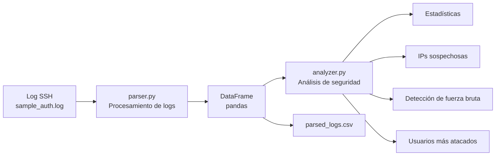
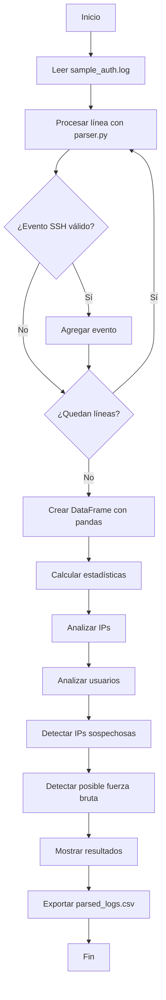

# Security Log Analyzer

Herramienta desarrollada en Python para analizar registros de autenticación SSH de Linux e identificar actividad potencialmente sospechosa.

El proyecto procesa eventos de inicio de sesión, obtiene estadísticas de autenticación y detecta patrones básicos que pueden estar relacionados con ataques de fuerza bruta.

## Características

- Lectura y análisis de logs de autenticación SSH.
- Detección de intentos de inicio de sesión exitosos y fallidos.
- Cálculo del porcentaje de autenticaciones fallidas.
- Identificación de las direcciones IP con más intentos fallidos.
- Identificación de los usuarios más atacados.
- Detección de direcciones IP sospechosas mediante un umbral de intentos fallidos.
- Detección básica de posibles ataques de fuerza bruta.
- Clasificación básica de severidad.
- Exportación de los eventos analizados a formato CSV.

## Tecnologías utilizadas

- Python 3
- pandas
- Expresiones regulares
- Linux
- Logs de autenticación SSH

## Arquitectura

El proyecto está dividido en componentes independientes para separar el procesamiento de los logs, el análisis de los eventos y la ejecución principal del programa.



### Componentes principales

- `parser.py`: interpreta las líneas de los logs SSH y extrae la información relevante.
- `analyzer.py`: analiza los eventos procesados y busca patrones potencialmente sospechosos.
- `main.py`: coordina la lectura, procesamiento, análisis y exportación de los resultados.
- `sample_auth.log`: contiene los registros SSH utilizados como datos de entrada.
- `parsed_logs.csv`: archivo generado con los eventos procesados.

## Instalación

Clonar el repositorio:

```bash
git clone git@github.com:angelDRivas/securityLogAnalyzer.git
```

Entrar al proyecto:

```bash
cd securityLogAnalyzer
```

Crear un entorno virtual:

```bash
python3 -m venv .venv
```

Activarlo:

```bash
source .venv/bin/activate
```

Instalar las dependencias:

```bash
pip install -r requirements.txt
```

## Uso

Ejecutar el programa desde la raíz del proyecto:

```bash
python3 src/main.py
```

El analizador procesará el archivo:

```text
data/sample_auth.log
```

y mostrará los resultados en la terminal.

Los eventos procesados también serán exportados a:

```text
output/parsed_logs.csv
```

## Ejemplo de detección

El programa puede detectar múltiples intentos fallidos provenientes de una misma dirección IP.

Ejemplo:

```text
=== BRUTE-FORCE DETECTION ===

[MEDIUM] 192.168.1.50 - 6 failed attempts - 4 targeted users
```

En este caso, la dirección IP realizó seis intentos fallidos de autenticación contra cuatro cuentas diferentes, por lo que el programa la identifica como actividad potencialmente sospechosa.

## ¿Cómo funciona?

El proyecto está dividido en tres componentes principales.

### `parser.py`

Se encarga de leer cada línea del log y extraer información relevante como:

- Fecha
- Hora
- Estado de autenticación
- Usuario
- Dirección IP
- Intentos realizados contra usuarios no válidos

Para realizar esta tarea se utilizan expresiones regulares.

### `analyzer.py`

Contiene las funciones encargadas de analizar los datos obtenidos.

Entre otras cosas, permite:

- Contar autenticaciones exitosas y fallidas.
- Identificar las IP con más fallos.
- Detectar los usuarios más atacados.
- Buscar direcciones IP que superen un determinado número de intentos fallidos.
- Detectar patrones básicos compatibles con ataques de fuerza bruta.
- Asignar un nivel básico de severidad a las detecciones.

### `main.py`

Es el punto de entrada del programa.

Se encarga de:

1. Leer el archivo de logs.
2. Enviar cada línea al parser.
3. Crear un DataFrame con pandas.
4. Ejecutar las funciones de análisis.
5. Mostrar los resultados.
6. Exportar los datos procesados a CSV.

## Flujo de ejecución

El siguiente diagrama representa el proceso general que sigue el programa desde la lectura del archivo hasta la generación de los resultados.



## Datos de prueba

Los registros incluidos en `data/sample_auth.log` son datos ficticios creados únicamente con fines educativos y de prueba.

El conjunto de datos simula diferentes escenarios de autenticación SSH, incluyendo:

- Inicios de sesión exitosos.
- Intentos de autenticación fallidos.
- Intentos repetidos desde una misma dirección IP.
- Intentos contra diferentes cuentas.
- Intentos contra usuarios no válidos.

No se utilizan direcciones IP públicas, contraseñas ni información real de usuarios.

## Objetivo del proyecto

Este proyecto fue desarrollado con fines de aprendizaje para practicar conceptos relacionados con:

- Python
- Linux
- Análisis de logs
- Seguridad informática
- Autenticación SSH
- Procesamiento de datos
- Expresiones regulares
- Detección básica de amenazas
